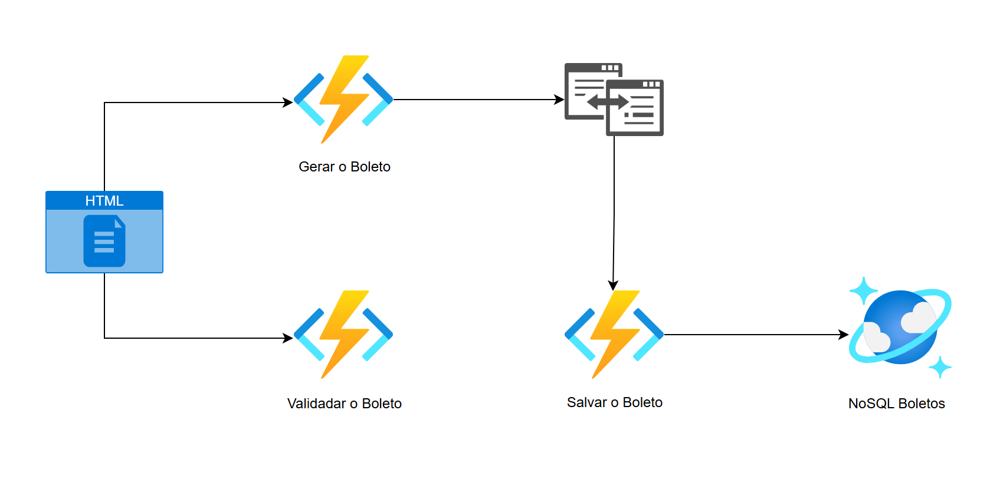
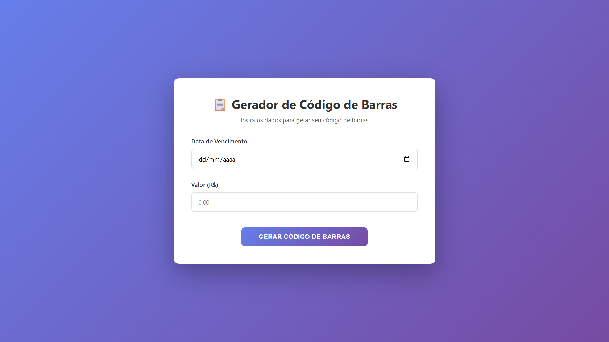
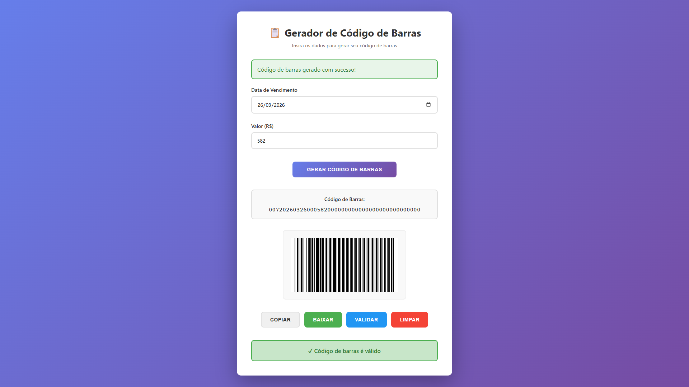
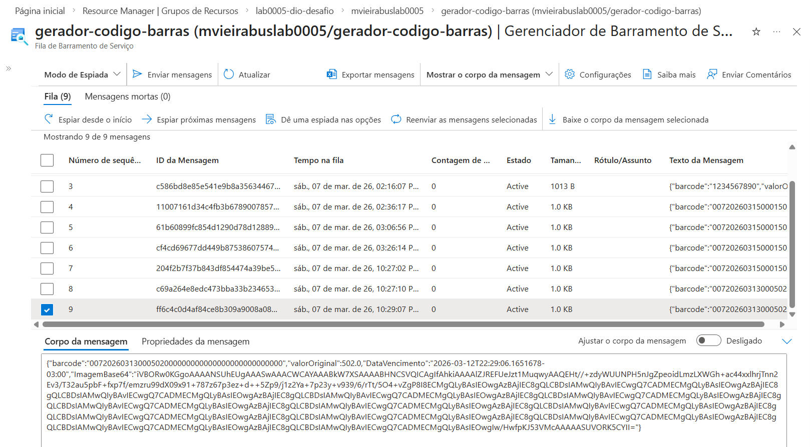
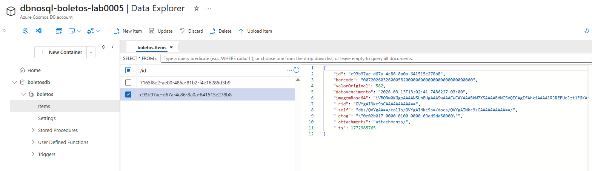

# Projeto Gerador de Código de Barras com Azure

## 📌 Sobre o Projeto

Este projeto foi desenvolvido durante o curso Microsoft Azure Cloud Native 2026, promovido pela Digital Innovation One (DIO).

O sistema permite gerar e armazenar boletos utilizando serviços do Microsoft Azure. Para isso, utiliza Azure Functions para processar as requisições, Azure Service Bus para comunicação entre os serviços e Azure Cosmos DB para armazenar os dados em um banco NoSQL.

O projeto demonstra um fluxo onde um site envia os dados do boleto para a nuvem, que processa e salva as informações no banco de dados.

## Estrutura do Projeto

* `front-end/index.html` – Interface web para interação do usuário, criada com HTML, CSS e JavaScript
* `fnGeradorBoletos/` – Azure Function HTTP para gerar o código de barras e enviar para a fila 
* `fnValidaBoleto/` – Azure Function HTTP para validar a integridade dos dígitos do boleto 
* `fnSalvaBoleto/` – Azure Function com Trigger de fila para persistência no banco de dados 
* `img/` – Documentação visual e diagramas do fluxo de dados

#### Diagrama da Arquitetura

*O fluxo inicia no Front-end, passa pela Function de geração, é postado no Service Bus e finaliza com a gravação automática no Cosmos DB.*

## 📸 Screenshots

#### 1. Interface de usuário (Front-end)

*Tela inicial onde o usuário insere a data de vencimento e o valor original do boleto.*

#### 2. Geração e validação de código

*Após clicar em gerar, o sistema consome a API, exibe a imagem em Base64 e permite validar o código gerado em tempo real.* 

#### 3. Gestão de filas via Azure Service Bus

*Os dados são enviados para o Service Bus para garantir o salvamento assíncrono.*

#### 4. Armazenamento final no Cosmos DB (NoSQL)

*O registo final é guardado no Cosmos DB com um ID único e metadados da Azure.*

## ▶️ Como Rodar o Projeto

Para rodar o projeto localmente e conectar aos serviços da Azure:

* Certifique-se de ter o Azure Functions Core Tools instalado.
* Use o Visual Studio 2022 ou VS Code.
* Configure o arquivo `local.settings.json` com suas Connection Strings.

> Importante: Por questões de segurança, o arquivo `local.settings.json` está incluído no `.gitignore` para evitar a exposição de chaves privadas.

## Tecnologias Utilizadas

| Tecnologia | Finalidade |
| --- | --- |
| HTML5 / CSS3 | Estrutura, estilização e responsividade |
| JavaScript | Integração do site com as APIs da Azure |
| Azure Functions | Processamento serverless (HTTP e Triggers) |
| Azure Service Bus | Desacoplamento e mensageria assíncrona |
| Azure Cosmos DB | Armazenamento NoSQL de documentos JSON |
| SkiaSharp | Geração da imagem do código de barras |
| .NET 8 | Ambiente de execução do backend |

## 💡 Aprendizados

* Implementação de comunicação assíncrona entre funções usando Service Bus.
* Modelagem de dados para Cosmos DB com foco em chaves de partição.
* Manipulação de imagens e conversão para Base64 em C#.
* Configuração de CORS para integração segura entre Front-end e Backend.

## 👩‍💻 Autora

Milla Regina Lopes Vieira** – [LinkedIn](https://www.linkedin.com/in/milla-regina-468020206/)